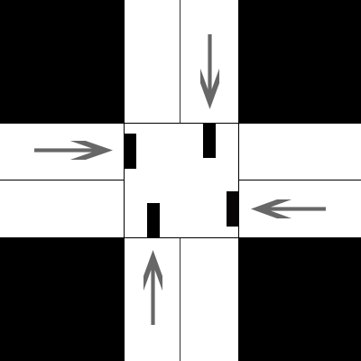
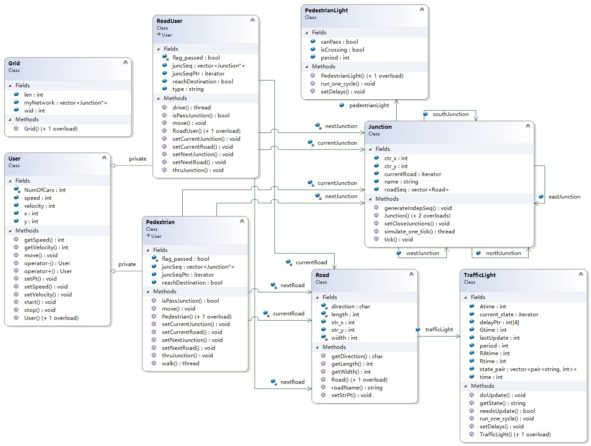

# TrafficLightSystem

## EE273 Class Project in University of Strathclyde

  Red, Amber, Green…. The operation of traffic lights and pedestrian crossings are, for all 
us,  a  familiar  and  an  ever  present  in  our  daily  lives.    The  operation  and  sequence  of 
traffic lights is well  understood  but  the  timing and  placement of  such  services is  not a 
trivial task. The aim of a traffic light system is to facilitate the smooth (efficient) flow of 
traffic  via  our  road  system.    In  this  project,  the  group  is  required  to  develop  an 
application that allows the user to configure a network of traffic lights (with or without a 
pedestrian crossing  feature) across an urban environment and  then show/demonstrate 
its operation in a time ordered fashion.  The user should be able to set up a network of 
roads with sets of lights at each junction and then step  through  the network operation 
while a “car” or user journeys through the system. The user may be a pedestrian or road 
user  (car,  motorcycle  or  bike).  The  programme  should  have  the  ability  to  define 
operation of light sequences (at each junction) to be globally synchronised or indeed to 
work  independently  –  subject  to  the  requirement  that  no  junction  would  permit 
contradicting  lights  to  be  “Green”  simultaneously.  No  deliberate  crashes!    As  a  first 
consideration, the group may want to consider grid based road systems such as Glasgow and New York  as exemplar networks.  It is left to the users to consider if filter lanes are 
to be considered. 

### Notes 
Need  to  look  as  some  of  the  other  projects  as  there  is  a  link  with  routing  and  traffic 
management. Note ascii characters – can change colours of display without the need to 
for GUI code – although use of GUI would be good. 

### Visualization

#### Junctio

     
#### UML Diagram

COPYRIGHT © 2020 Yuchen Rao & Logan Clark，All rights reserved.
